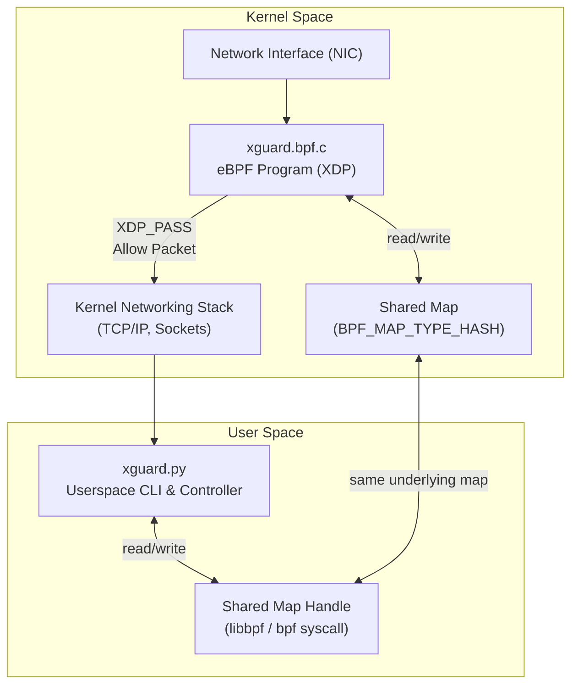

## Overview

**xguard** is a lightweight eBPF/XDP tool for tracing live ingress traffic at the L3/L4 layers of the TCP/IP stack, built for the [eBPF Summit: Hackathon Edition 2025](https://ebpf-summit-2025.devpost.com).  It is designed primarily as a **learning project** to explore:
- How **eBPF/XDP programs** operate inside the kernel.
- Basic **eBPF map** usage.
- Low-level **L3/L4 packet filtering**.

The current implementation uses Python for rapid prototyping and ease of development. However, it has several limitations:
- Incomplete support for IPv6 and port handling.
- Output handling is currently minimal and oversimplified, requiring further improvement—especially for kernel-level tracing, which tends to be very noisy.

## CLI Usage
<pre style="user-select: none; white-space: pre-wrap; word-wrap: break-word;">
Usage:
    xguard --interface <iface> --kernel-trace | --userspace-trace [--tcp | --udp | --icmp]

Required:
    --interface <iface>                                    Network interface to monitor (e.g., eth0).
    --kernel-trace | --userspace-trace              One of these options must be selected: Tracing mode (kernel or userspace).

Optional (only available with --userspace-trace):
    --tcp                                           Trace only TCP traffic.
    --udp                                           Trace only UDP traffic.
    --icmp                                          Trace only ICMP traffic.
</pre>

## Tests

Assumptions:
* Ubuntu 24.04 VM was used.
* sudo used to run xguard CLI.
* Interface is set to enp0s1.
* ```ping google.com``` was ran to generate some traffic and left running in a seperate terminal.

1. ```sudo ./xguard.py --interface enp0s1 --kernel-trace```


The --kernel-trace option comes directly from the eBPF/XDP program and is very verbose and low level and prints the following:
* Event Data (autognerated):
  * PID
  * CPU Core
  * Scheduler State
  * Timestamp (NS)
* Shared kernel/userspace hash map:
  * Ethernet Type (converted to Little-endian)
  * Source IP (Big-endian)
  * Protocol (Big-endian)

2. ```sudo ./xguard.py --interface enp0s1 --userspace-trace```


The --userspace-trace option will, by default, capture TCP/UDP/ICMP and IPv4 only. These can be filtered with the appropriate options. The main difference is that the output is more human-readable and less verbose. Helper functions were created to make this task simpler. A shared kernel/userspace hash map was used to gather the traffic and count the hits for each unique incoming network packet (Ethernet Type + Source IP + Protocol).

One key lesson learned was the assumption that any IP would be passed to userspace without checking the IP version. Without an IP version check, the program read directly from the IPv4 struct and wrote the data to the shared kernel/userspace hash map as a 32-bit Big-endian field.

While this doesn't cause major errors, it results in writing random bits when handling IPv6 packets.  The solution is to explicitly check for IPv4 or IPv6, use the correct struct for each, and store the addresses in the appropriate Big-endian data fields in the shared hash map. The short-term fix was to add error handling in the userspace program to skip invalid output.

3. Running ```sudo ip a | grep enp0s1``` will query the NIC and if the eBPF/XDP programm has been atached it will be show as such:
<pre style="user-select: none; white-space: pre-wrap; word-wrap: break-word;">
   2: enp0s1: <BROADCAST,MULTICAST,UP,LOWER_UP> mtu 1500 xdp/id:69 qdisc fq_codel state UP group default qlen 1000
   inet 192.168.2.6/24 metric 100 brd 192.168.2.255 scope global dynamic enp0s1
</pre>
**xdp/id:69** indicates an eBPF/XDP program with ID 69 is attached on this networking interface.

## ⚡ How It Works


## Improvements

* Move more of the network-packet filtering into the eBPF program for better performance.
* Add the ability to trace based on time ranges, especially since kernel traces can be very noisy.
* Add the ability to export to common logging formats, e.g. JSON, CSV, Prometheus, etc.


## Final Thoughts

The **eBPF Summit: Hackathon Edition 2025** was a great learning experience. Below is the assembled eBPF LEGO obtained at Kubernetes Community Days Edinburgh 2025 after completing Cilium Cluster Mesh training by Isovalent.


