# 🔒 xguard

Lightweight eBPF/XDP tool for tracing live ingress traffic — built for the [eBPF Summit 2025 Devpost](https://ebpf-summit-2025.devpost.com).


## 📖 Overview

**xguard** is a lightweight eBPF/XDP tool for tracing live ingress traffic at L3/3 layer.  It is designed primarily as a **learning project** to explore:

- How **XDP programs** operate inside the kernel.
- Basic **eBPF map** usage.
- Low-level **L3/L4 packet filtering**.

The current implementation uses **Python** for quick prototyping and simplicity. Future iterations may include:

- A full **C-based eBPF + userspace** version.
- A **Go-based userspace** implementation.
- More advanced filtering (e.g., ports, IPv6, other protocols).

## 🧰 CLI Usage
<pre style="user-select: none; white-space: pre-wrap; word-wrap: break-word;">
Usage:
    xguard --interface <iface> --kernel-trace | --userspace-trace [--tcp | --udp | --icmp]

Required:
    --interface <iface>                 Network interface to monitor (e.g., eth0).
    --kernel-trace | --userspace-trace  One of these options must be selected: Tracing mode (kernel or userspace).

Optional (only available with --userspace-trace):
    --tcp                               Trace only TCP traffic.
    --udp                               Trace only UDP traffic.
    --icmp                              Trace only ICMP traffic.
</pre>

## 🧰 Tests

Assumptions:
* Ubuntu 24.04 VM was used.
* sudo is needed to run xguard CLI.
* Interface set to enp0s1.
* ```ping google.com``` to generate some traffic was left running in seperate terminal.

1. ```sudo ./xguard.py --interface enp0s1 --kernel-trace```


The kernel-trace option comes direct from eBPF/XDP program and is very verbose and low level and prints the following:
* Event Data (autognerated):
  * PID
  * CPU Core
  * Scheduler State
  * Timestamp (NS)
* Shared kernel/userspace map:
  * Ethernet Type (converted to Little-endian)
  * Source IP (Big-endian)
  * Protocol (Big-endian)

2. ```sudo ./xguard.py --interface enp0s1 --userspace-trace```


The userspace-trace will by default capture TCP/UDP/ICMP and IPv4 only, these can be filtered with approperate options.  The difference is mainly the output
is more human readble and less verbose.  Helper functions were created to make this task simplier.  A shared map (kernel/userspace) was used to gather the traffic 
and count the hits for each unique incoming network packet for Ethernet Type+Source IP+Protocol. 
One interesting leraning here was assumption that any IP would get passed upto userspace. But as the offset start is the same for both IP4/IP6 it was getting stored in a 32-bit Big-endian and in the case of IPv6 is 128-bit and thus cuased random bits passed in.  The soliution is to check for IPv4/IPv6 and use correct struct.  This will be a TODO for now.

3. Running ```sudo ip a | grep enp0s1``` will query the NIC and if the eBPF/XDP programm has been atached it will be show as such:
<pre style="user-select: none; white-space: pre-wrap; word-wrap: break-word;">
   2: enp0s1: <BROADCAST,MULTICAST,UP,LOWER_UP> mtu 1500 *xdp/id:69* qdisc fq_codel state UP group default qlen 1000
   inet 192.168.2.6/24 metric 100 brd 192.168.2.255 scope global dynamic enp0s1
</pre>

## ⚡ How It Works

```mermaid
flowchart TD
    subgraph "🧱 Kernel Space"
        NIC["📡 Network Interface (NIC)"]
        XDP["⚡ xguard.bpf.c<br>eBPF Program (XDP)"]
        KernelStack["🧠 Kernel Networking Stack<br>(TCP/IP, Sockets)"]
        MapK["🗂️ Shared Map<br>(BPF_MAP_TYPE_*)"]
    end

    subgraph "👨‍💻 User Space"
        App["xguard.py<br>Userspace CLI & Controller"]
        MapU["🗂️ Shared Map Handle<br>(libbpf / bpf syscall)"]
    end

    NIC --> XDP
    XDP -- "XDP_PASS<br>Allow Packet" --> KernelStack    

    KernelStack --> App

    %% Shared Map connections
    XDP <-- "read/write" --> MapK
    App <-- "read/write" --> MapU
    MapK <-- "same underlying map" --> MapU
```


## Final Thoughts

The **Kubernetes Community Days Edinburgh 2025** was an incredible learning experience. I had the opportunity to dive deep into **Kubernetes**, **Client Cluster Mesh**, and the powerful **tools** that help us build scalable cloud-native applications. One of the highlights of the event was receiving a special **LEGO** model, which serves as a reminder of the collaborative spirit and innovation we saw at the conference.

It was a great chance to network, share knowledge, and explore how Kubernetes and cloud-native technologies are shaping the future of software development.

Here's a photo of the **LEGO** model I received after the **Client Cluster Mesh** training session:


This experience truly reinforced the power of open-source communities and the amazing tools that Kubernetes provides. I look forward to contributing to these projects and continuing to learn from the community.


