# 🔒 xguard

**** Lightweight eBPF/XDP tool for tracing live ingress traffic — built for the [eBPF Summit 2025 Devpost](https://ebpf-summit-2025.devpost.com).


## 📖 Overview

**xguard** is a lightweight eBPF/XDP tool for tracing live ingress traffic at L3/3 layer.  It is designed primarily as a **learning project** to explore:

- How **XDP programs** operate inside the kernel.
- Basic **eBPF map** usage.
- Low-level **L3/L4 packet filtering**.

The current implementation uses **Python** for quick prototyping and simplicity. Future iterations may include:

- A full **C-based eBPF + userspace** version.
- A **Go-based userspace** implementation.
- More advanced filtering (e.g., ports, IPv6, other protocols).

## 🧰 CLI Usage

```
    Usage:
        xguard --interface <iface> --kernel-trace | --userspace-trace [--tcp | --udp | --icmp]

    Required:
        --interface <iface>                 Network interface to monitor (e.g., eth0).
        --kernel-trace | --userspace-trace  One of these options must be selected: Tracing mode (kernel or userspace).

    Optional (only available with --userspace-trace):
        --tcp                               Trace only TCP traffic.
        --udp                               Trace only UDP traffic.
        --icmp                              Trace only ICMP traffic.
```

## ⚡ How It Works

```mermaid
flowchart TD
    subgraph "🧱 Kernel Space"
        NIC["📡 Network Interface (NIC)"]
        XDP["⚡ xguard.bpf.c<br>eBPF Program (XDP)"]
        KernelStack["🧠 Kernel Networking Stack<br>(TCP/IP, Sockets)"]
    end

    subgraph "👨‍💻 User Space"
        App["xguard.py<br>Userspace CLI & Controller"]
    end

    NIC --> XDP
    XDP -- "XDP_PASS<br>Allow Packet" --> KernelStack    

    KernelStack --> App
```

