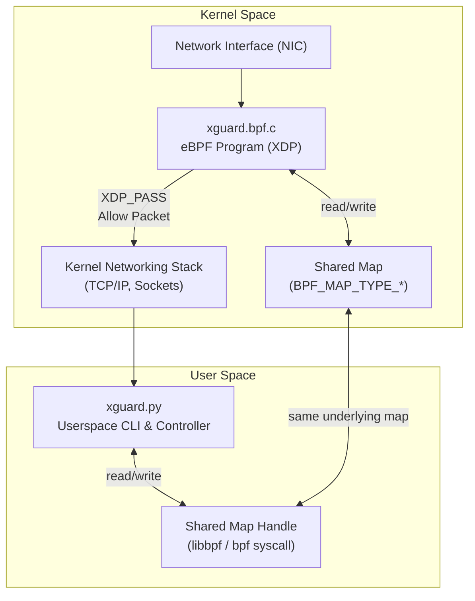

# xguard

Lightweight eBPF/XDP tool for tracing live ingress traffic — built for the [eBPF Summit: Hackathon Edition 2025](https://ebpf-summit-2025.devpost.com).

## Overview

**xguard** is a lightweight eBPF/XDP tool for tracing live ingress traffic at the L3/L4 layer. It is designed primarily as a **learning project** to explore:

- How **XDP programs** operate inside the kernel.
- Basic **eBPF map** usage.
- Low-level **L3/L4 packet filtering**.

The current implementation uses **Python** for quick prototyping and simplicity. Future iterations may include:

- A full **C-based eBPF + userspace** version.
- A **Go-based userspace** implementation.
- More advanced filtering (e.g., ports, IPv6, other protocols).
- More control over output, especially for kernel tracing.

## CLI Usage
<pre style="user-select: none; white-space: pre-wrap; word-wrap: break-word;">
Usage:
    xguard --interface <iface> --kernel-trace | --userspace-trace [--tcp | --udp | --icmp]

Required:
    --interface <iface>                 Network interface to monitor (e.g., eth0).
    --kernel-trace | --userspace-trace  One of these options must be selected: Tracing mode (kernel or userspace).

Optional (only available with --userspace-trace):
    --tcp                               Trace only TCP traffic.
    --udp                               Trace only UDP traffic.
    --icmp                              Trace only ICMP traffic.
</pre>

## 🧰 Tests

Assumptions:
* Ubuntu 24.04 VM was used.
* sudo is needed to run xguard CLI.
* Interface set to enp0s1.
* ```ping google.com``` to generate some traffic was left running in seperate terminal.

1. ```sudo ./xguard.py --interface enp0s1 --kernel-trace```


The kernel-trace option comes direct from eBPF/XDP program and is very verbose and low level and prints the following:
* Event Data (autognerated):
  * PID
  * CPU Core
  * Scheduler State
  * Timestamp (NS)
* Shared kernel/userspace map:
  * Ethernet Type (converted to Little-endian)
  * Source IP (Big-endian)
  * Protocol (Big-endian)

2. ```sudo ./xguard.py --interface enp0s1 --userspace-trace```


The --userspace-trace option will, by default, capture TCP/UDP/ICMP and IPv4 only. These can be filtered with the appropriate options. The main difference is that the output is more human-readable and less verbose. Helper functions were created to make this task simpler. A shared map (kernel/userspace) was used to gather the traffic and count the hits for each unique incoming network packet (Ethernet Type + Source IP + Protocol).
One interesting learning here was the assumption that any IP would get passed up to userspace. But as the offset start is the same for both IPv4/IPv6, it was getting stored in a 32-bit Big-endian format, and in the case of IPv6 (which is 128-bit), random bits were passed. The solution is to check for IPv4/IPv6 and use the correct struct. This will be a TODO for now.

3. Running ```sudo ip a | grep enp0s1``` will query the NIC and if the eBPF/XDP programm has been atached it will be show as such:
<pre style="user-select: none; white-space: pre-wrap; word-wrap: break-word;">
   2: enp0s1: <BROADCAST,MULTICAST,UP,LOWER_UP> mtu 1500 *xdp/id:69* qdisc fq_codel state UP group default qlen 1000
   inet 192.168.2.6/24 metric 100 brd 192.168.2.255 scope global dynamic enp0s1
</pre>

## ⚡ How It Works


## Final Thoughts

The **eBPF Summit: Hackathon Edition 2025** was a great learning experience. Below is the assembled eBPF LEGO I obtained at Kubernetes Community Days Edinburgh 2025 after completing Cilium Cluster Mesh training by Isovalent.


